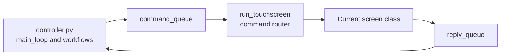
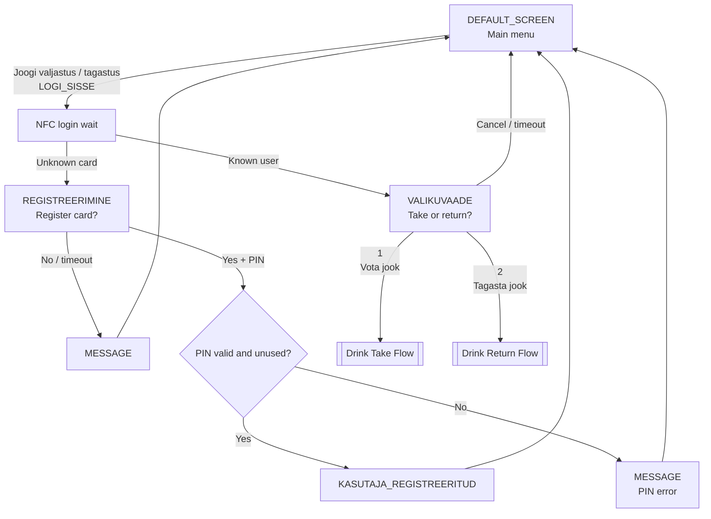
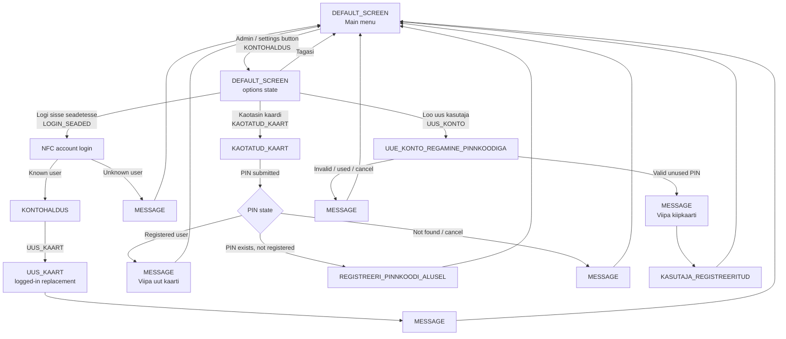
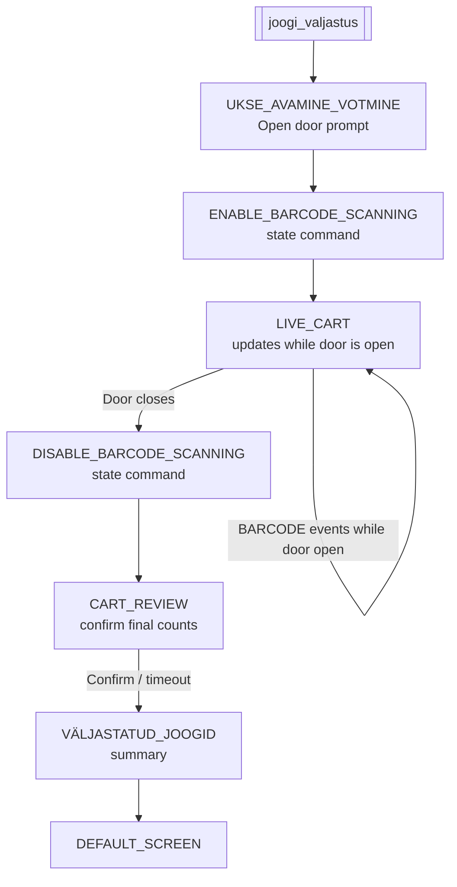
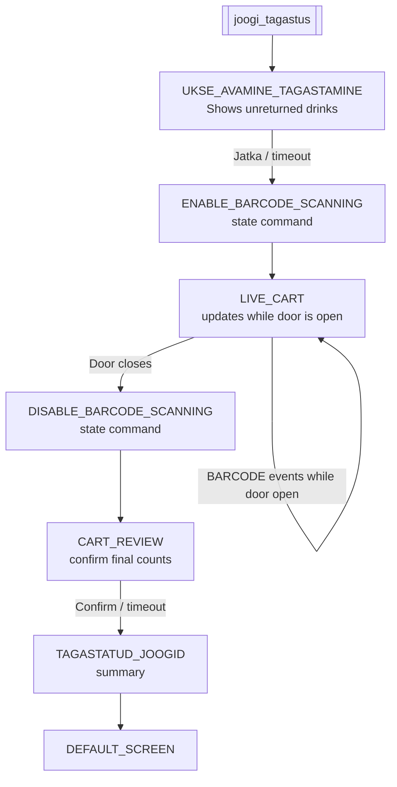
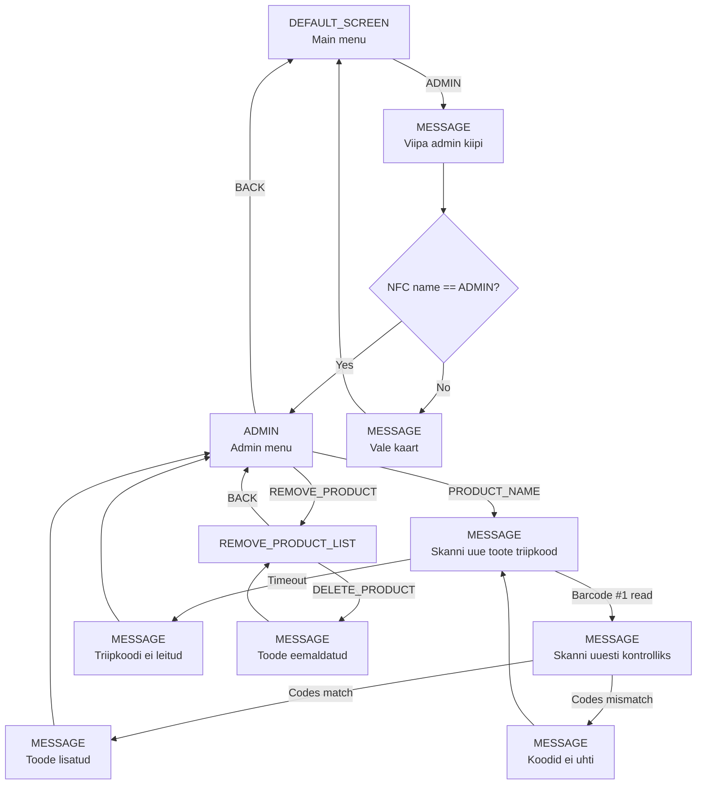

# UI Screen Flow

This document maps the current touchscreen flow from:

- [sinine_kapp/app/controller.py](/home/skpi/Sinine-kapp/Sinine-kapp/sinine_kapp/app/controller.py)
- [sinine_kapp/ui/touchscreen.py](/home/skpi/Sinine-kapp/Sinine-kapp/sinine_kapp/ui/touchscreen.py)

The controller owns the cabinet logic. The touchscreen process only shows screens, waits for local UI input, and sends replies back through `reply_queue`.

## Main Menu And Login

## Account And Card Management

## Drink Take Flow

## Drink Return Flow

## Admin Flow

## Screen Command Reference

| Command | Screen / action | Notes |
| --- | --- | --- |
| `DEFAULT` | `DEFAULT_SCREEN` | Main menu and secondary account options state. |
| `VALIKUVAADE` | `VALIKUVAADE` | User chooses drink take or drink return after NFC login. |
| `UKSE_AVAMINE_VÕTMINE` | `UKSE_AVAMINE_VÕTMINE` | Door prompt before taking drinks. |
| `UKSE_AVAMINE_TAGASTAMINE` | `UKSE_AVAMINE_TAGASTAMINE` | Door prompt before returning drinks. |
| `LIVE_CART` | `LIVE_CART` | Runtime cart display while the door is open and barcodes are scanned. |
| `CART_REVIEW` | `CART_REVIEW` | Final editable/confirmable counts after door close. |
| `VÄLJASTATUD_JOOGID` | `VÄLJASTATUD_JOOGID` | Summary after taking drinks. |
| `TAGASTATUD_JOOGID` | `TAGASTATUD_JOOGID` | Summary after returning drinks. |
| `REGISTREERIMINE` | `REGISTREERIMINE` | Unknown card registration prompt. |
| `KASUTAJA_REGISTREERITUD` | `KASUTAJA_REGISTREERITUD` | Registration success screen. |
| `KONTOHALDUS` | `KONTOHALDUS` | Logged-in account management screen. |
| `UUS_KAART` | `UUS_KAART` | New/replacement card flow for logged-in user. |
| `KAOTATUD_KAART` | `KAOTATUD_KAART` | Lost card PIN flow. |
| `REGISTREERI_PINNKOODI_ALUSEL` | `REGISTREERI_PINNKOODI_ALUSEL` | Existing PIN registration flow. |
| `UUE_KONTO_REGAMINE_PINNKOODIGA` | `UUE_KONTO_REGAMINE_PINNKOODIGA` | New account PIN flow. |
| `ADMIN` | `ADMIN` | Admin product add/remove menu. |
| `REMOVE_PRODUCT_LIST` | `REMOVE_PRODUCT_LIST` | Admin product deletion list. |
| `MESSAGE` | `MESSAGE` | Shared status/error/wait screen. |
| `REKLAAM` | `REKLAAM` | Defined in UI, but not part of the current main controller flow. |
| `ENABLE_BARCODE_SCANNING` | state command | Enables barcode reader events inside the UI process. |
| `DISABLE_BARCODE_SCANNING` | state command | Disables barcode reader events inside the UI process. |
| `STOP` | process control | Exits the touchscreen process. |

## Cleanup Notes For The UI Rework

- `DEFAULT_SCREEN` currently handles both the main menu and an internal `options` state. Splitting those into two screens would make routing clearer.
- `MESSAGE` is doing several jobs: status screen, error screen, confirmation screen, and NFC/barcode wait screen. It may be worth separating passive status from actionable prompts.
- `LIVE_CART` and `CART_REVIEW` are shared by take and return flows, which is good. They should probably stay generic and receive a mode label from the controller.
- Barcode scanning is controlled by non-screen commands. That is reasonable, but it should be documented clearly because it affects input behavior without changing screens.
- `REKLAAM` is still implemented but appears unused by the current main flow.
- The admin product flow is still controller-heavy. Later cleanup could move product add/remove orchestration into a small admin workflow module.
